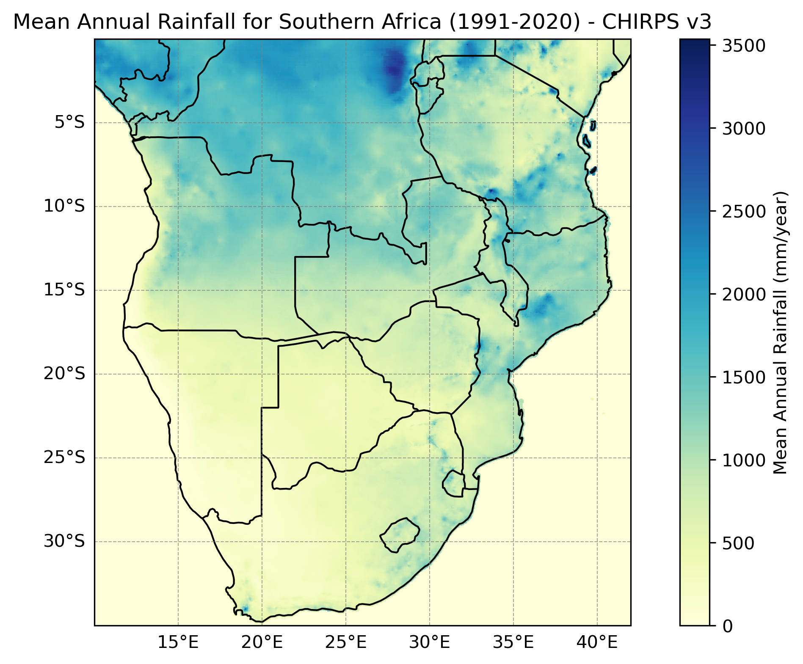
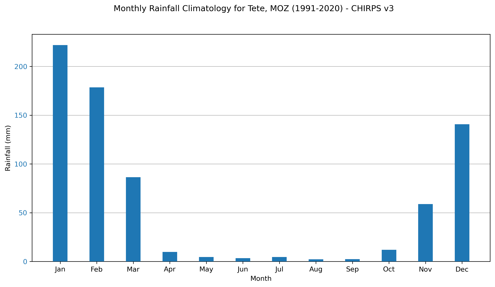
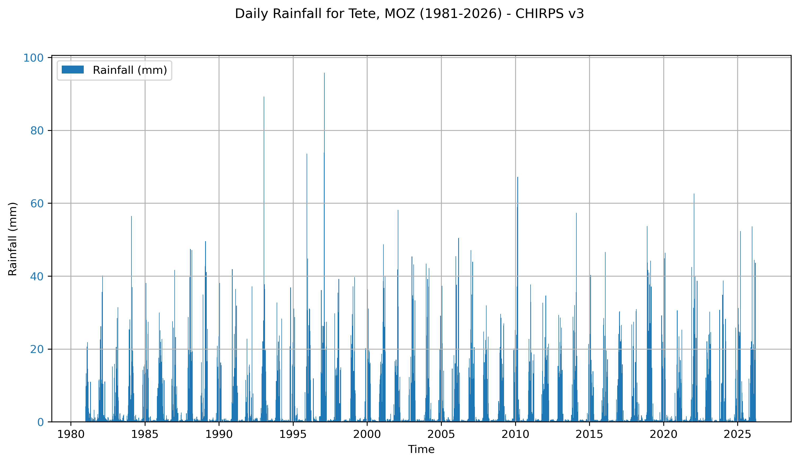
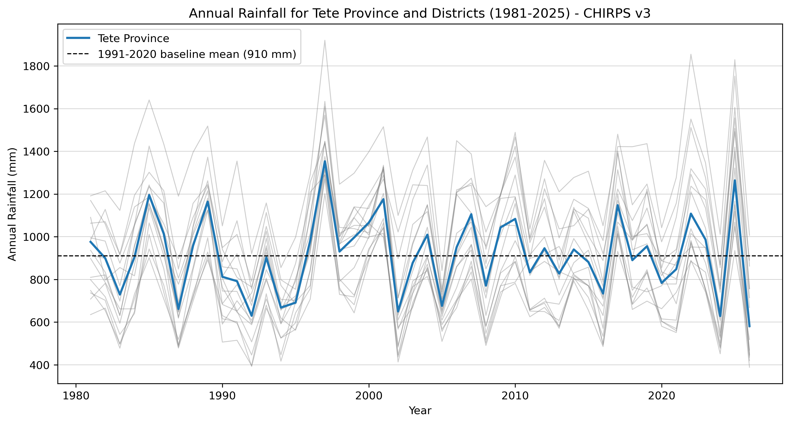

::: {.page-tabs .panel-tabset}

## Overview

<h2>About the data</h2>

The Climate Hazards Center InfraRed Precipitation with Station data (CHIRPS) is a 40+ year quasi-global, land-only, gridded rainfall dataset designed to provide blended gauge-satellite precipitation estimates with high spatial resolution, low latency, low bias, and a long period of record. CHIRPS version 3 (CHIRPS v3) spans 60°N–60°S and all longitudes, available at 0.05° resolution. It is created by combining thermal-infrared geostationary satellite-based estimates with in-situ station observations from global, regional, and national meteorological networks, alongside a high-resolution climatology (CHPclim2). The dataset begins in 1981 and extends to near-present.

Two CHIRPS v3 products are available — a rapidly updated preliminary product (CHIRPS Prelim) released two days after the end of each pentad, and a final product. Users requiring the most recent data should use CHIRPS Prelim, while the final product is recommended for research applications where accuracy is prioritised over timeliness.

For more information regarding CHIRPS v3 see the [CHIRPS website](https://www.chc.ucsb.edu/data/chirps3).

Users can also find more information about the CHIRPS dataset here:

- Climate Data Guide: [CHIRPS: Climate Hazards InfraRed Precipitation with Station data (Version 3)](https://climatedataguide.ucar.edu/climate-data/chirps-climate-hazards-infrared-precipitation-station-data-version-3)

### Summary

| | |
--- | --- |
| **Name** | CHIRPS v3 |
| **Institution** | [Climate Hazards Center (CHC), UC Santa Barbara](https://chc.ucsb.edu/) |
| **Product type** | gridded observed |
| **Domain** | global land (60°S–60°N) |
| **Resolution** | 0.05° x 0.05° |
| **Period** | 1981–present |
| **Frequencies** | daily, pentad, dekad, monthly, annual |
| **Variables** | Precipitation |
| **Update frequency (latency)** | Preliminary: 2 days after end of pentad; Final: ~1 month |

#### Variables

| **Variable Name** | **Variable Description** | **Units** |
--- | --- | --- |
| precip | total precipitation | millimetres per day |

<h2>Accessing the data</h2>

CHIRPS v3 data can be downloaded from several different platforms.

::: {.panel-tabset}
### Climate Hazards Center (CHC)
The CHC provides direct access to CHIRPS v3 data via their [data repository](https://data.chc.ucsb.edu/products/CHIRPS/v3.0/). This is the best source for accessing the most up-to-date version of the dataset. Users requiring near real-time data should use the [preliminary product](https://data.chc.ucsb.edu/products/CHIRPS/v3.0/daily/prelim/sat/), which is available 2 days after the end of each pentad. 

Note that daily data is derived by disaggregating pentadal totals using either ERA5 (`rnl`) or IMERG (`sat`) as the disaggregation source. Users should select the appropriate product for their application.

| **Domain** | **Frequency** | **Resolution** | **File Format** |
|------------|---------------|----------------|-----------------|
| global | daily final | 0.05°, 0.25° | .tif, .nc, .cog |
| global | daily prelim | 0.05° | .tif, .nc (current year only) |
| africa | pentad | 0.05° | .tif, .bil, .png |
| global | pentad | 0.05° | .tif, .bil, .nc, .cog |
| africa | dekad | 0.05° | .tif, .bil, .png |
| global | dekad | 0.05° | .tif, .bil, .nc |
| africa | monthly | 0.05° | .tif, .bil, .png |
| global | monthly | 0.05° | .tif, .bil, .nc, .cog |
| africa | annual | 0.05° | .tif |
| global | annual | 0.05° | .tif, .nc |

### Climate Data Store (CDS)
The [Copernicus Climate Data Store (CDS)](https://cds.climate.copernicus.eu/) provides access to CHIRPS v2 data via the [Temperature and precipitation gridded data for global and regional domains derived from in-situ and satellite observations](https://cds.climate.copernicus.eu/datasets/insitu-gridded-observations-global-and-regional?tab=overview) dataset. 

Note that this source only provides CHIRPS v2, not v3.

| **Domain** | **Frequency** | **Resolution** | **File Format** |
|------------|---------------|----------------|-----------------|
| africa | daily | 0.25° | .nc |

### Early Warning Explorer (EWX)
The [Early Warning Explorer (EWX)](https://ewx3.chc.ucsb.edu/ewx/index.html) is an interactive tool developed by CHC that allows users to visualise, subset, plot time series, and download maps of CHIRPS v3 (and v2) and other data products. It is a useful option for users who prefer not to work directly with raw data files.
:::

<h2>What the data looks like</h2>

Below is a spatial plot of mean annual rainfall over Southern Africa for the 1991-2020 climatology period, giving a sense of the spatial coverage and resolution of the CHIRPS v3 dataset.

:::{.cell}
{fig-align="center"}
:::

The plots below show the monthly rainfall climatology and daily rainfall time series for Tete, Mozambique, illustrating the seasonal cycle and temporal extent of the dataset.

:::{.cell}
{fig-align="center"}
:::

:::{.cell}
{fig-align="center"}
:::

<h2>Key points to consider</h2>

CHIRPS v3 is a blended gauge-satellite product, meaning its estimates are influenced by both the density of available station observations and the quality of the underlying satellite data. In regions with sparse station networks, which includes much of rural Africa, the satellite component plays a larger role and accuracy may differ compared to well-gauged regions. Users should also be aware that the number of reporting stations can vary from month to month, which means data quality may not be consistent throughout the record.

Daily CHIRPS data should be used with caution. CHIRPS is fundamentally a pentadal and monthly product; daily estimates are derived by disaggregating pentadal totals using the fraction of cold cloud cover each day as a guide. This means daily values do not directly reflect observed daily rainfall and are less reliable for capturing extreme daily rainfall events. For analyses focused on daily extremes, users should validate against local station data where possible.

CHIRPS uses thermal infrared satellite observations to estimate rainfall by detecting cold cloud tops. This approach can miss warm rain events that form in the lower troposphere without deep cloud development. In the E8 region, this is worth keeping in mind during transitional seasons when shallow convection can contribute meaningfully to rainfall totals.

CHIRPS v3 is overall wetter than CHIRPS v2 due to the introduction of a gauge-undercatch correction, which adjusts station data to account for wind-induced underestimation of rainfall. Users transitioning from v2 to v3, or comparing results across versions, should account for this systematic difference. Similarly, when comparing CHIRPS v3 with station observations, CHC recommends using gauge-undercatch corrected station data to ensure a like-for-like comparison.

As is the case with most gridded climate datasets, CHIRPS provides its time variable in Coordinated Universal Time (UTC). If working in a time zone far from UTC, you may need to adjust the time variable to align with your local time zone when interpreting daily totals. Southern Africa is typically UTC+2, meaning a daily rainfall total in CHIRPS reflects rainfall from 2 AM to 2 AM local time.

<h3>Strengths</h3>

- High spatial resolution (0.05°) with quasi-global land coverage from 60°N to 60°S.
- Long continuous record from 1981 to near-present, suitable for trend analysis and climatological studies.
- Rapid update frequency with a preliminary product available within 2 days of the end of each pentad.
- Blends satellite estimates with in-situ station observations from over 90 sources, nearly four times more than CHIRPS v2, improving accuracy particularly in data-sparse regions.
- Rigorous quality control including automated screening and monthly human visual inspection before final production.
- Gauge-undercatch correction applied in v3 improves the accuracy of station inputs compared to v2.
- Improvements to the satellite algorithm in v3 result in better estimation of precipitation variance and extreme events compared to v2.
- Well validated over East Africa and shown to outperform similar products such as ARC2 at dekadal and monthly timescales.

<h3>Limitations</h3>

- Provides precipitation only and does not include temperature or other variables required for malaria modelling.
- Daily data is derived by disaggregating pentadal totals rather than being directly observed at daily resolution; use with caution for daily-scale analyses.
- Performance degrades in regions with sparse station networks and may vary over time as the number of reporting stations changes.
- Tends to underestimate extreme rainfall events, particularly at the daily timescale.
- Thermal infrared approach can miss warm rain events in the lower troposphere.
- CHIRPS v3 is systematically wetter than CHIRPS v2; direct comparisons between versions should account for this difference.

<h2>Citing the data</h2>

Funk, C., Peterson, P., Landsfeld, M. et al. The climate hazards infrared precipitation with stations: a new environmental record for monitoring extremes. *Sci Data* 2, 150066 (2015). [DOI:10.1038/sdata.2015.66](https://doi.org/10.1038/sdata.2015.66)

When citing the CHIRPS v3 data repository directly, please also include: Climate Hazards Center Infrared Precipitation with Stations version 3 (CHIRPS3) Data Repository (2025). [DOI:10.15780/G2JQ0P](https://doi.org/10.15780/G2JQ0P). Data was accessed on [DATE].

<h3>Terms of use</h3>

CHIRPS v3 data are made freely available under the  [Creative Commons Attribution 4.0 International (CC BY 4.0)](https://creativecommons.org/licenses/by/4.0/) license. Users are free to share and adapt the data for any purpose, provided appropriate credit is given. This replaces the public domain waiver used for CHIRPS v2.

## Visualisations

The visualisations below use CHIRPS v3 data to explore rainfall variability across Tete Province, Mozambique, at both provincial and district level. Tete Province was selected as an example location within the E8 region to demonstrate how CHIRPS v3 can be aggregated to administrative units, which is a common requirement when working with climate-sensitive disease data.

<h2>How to use this data?</h2>

Gridded rainfall datasets like CHIRPS v3 provide spatially continuous coverage that can be aggregated to administrative units, making them well suited for district- or provincial-level analyses relevant to climate-sensitive disease surveillance and modelling.

In this example we use CHIRPS v3 daily data at 0.05° resolution accessed from the Climate Hazards Center data repository. Rather than extracting a single grid cell to represent a district or province, we demonstrate area-weighted spatial averaging, a method that accounts for the fact that grid cells near the equator cover slightly more area than those further away. This approach produces a more representative rainfall estimate for an administrative unit than a simple mean of grid cell values.

Administrative boundaries for Mozambique were sourced from the [Humanitarian Data Exchange (HDX)](https://data.humdata.org/dataset/cod-ab-moz).

The following preparation steps were applied to the data:

- For each district, a spatial mask was created using the district boundary and area weights were applied based on the cosine of latitude.
- Monthly district totals were accumulated and then summed to produce annual totals and DJF (December-January-February) seasonal totals.
- A 1991-2020 baseline period was used for all anomaly and percentile calculations. The 90th percentile threshold for extreme DJF seasons was calculated from the distribution of annual DJF seasonal totals over this period.

<h2>How to plot the data?</h2>

Figure 1 shows the mean annual rainfall anomaly for each district in Tete Province for the period 2016-2025, expressed as a percentage relative to the 1991-2020 baseline.

:::{.cell}
{fig-align="center"}
:::

A clear spatial pattern emerges across the province. Districts in the north and east, particularly Macanga, Angonia and Chifunde, have been notably wetter in the recent decade compared to the 1991-2020 baseline. Western districts including Magoe and Zumbu have experienced slightly drier conditions. This spatial heterogeneity would be missed if only a single grid cell or provincial mean were used for analysis.

Figure 2 shows the annual area-weighted rainfall for Tete Province and each individual district over the full CHIRPS v3 record from 1981 to 2025.

:::{.cell}
{fig-align="center"}
:::

The time series reveals considerable interannual variability in rainfall across Tete Province, with annual totals ranging from below 600 mm to above 1300 mm for the provincial mean. The spread between individual districts is substantial, with some districts receiving nearly twice the rainfall of others in the same year. This highlights the importance of working at district level rather than using a single provincial value when assessing rainfall impacts on malaria transmission.

The DJF season corresponds to the peak of the malaria transmission season across much of southern Africa, making extreme rainfall events during this period particularly relevant for disease burden. Figure 3 shows the number of extreme DJF seasons experienced by each district between 2016 and 2025, where a season is classified as extreme if the district total exceeds the 90th percentile of DJF totals in the 1991-2020 baseline period.

:::{.cell}
{fig-align="center"}
:::

Macanga experienced the greatest number of extreme DJF seasons in the recent decade (3 out of 10), consistent with its strongly positive anomaly in Fig. 1. In contrast, Zumbu, Magoe, Maravia and Chiuta recorded no extreme DJF seasons during this period, suggesting that the recent wetting trend in Tete Province has been spatially uneven and concentrated in the northern and eastern districts.

These visualisations are intended as an example of how CHIRPS v3 can be used for district-level rainfall analysis. The district-level aggregation approach is reproducible for any administrative unit provided boundary files are available, and area-weighting ensures spatial accuracy across districts of varying size. However, users should be aware that districts smaller than the CHIRPS grid resolution (0.05°, approximately 5 km) may be represented by very few grid cells, which can affect the reliability of area-averaged estimates. The 10-year comparison period (2016-2025) is relatively short for detecting statistically robust trends, and results are sensitive to the choice of baseline period. A different baseline would produce different anomaly and extreme season classifications.

## Modelling 

:::

